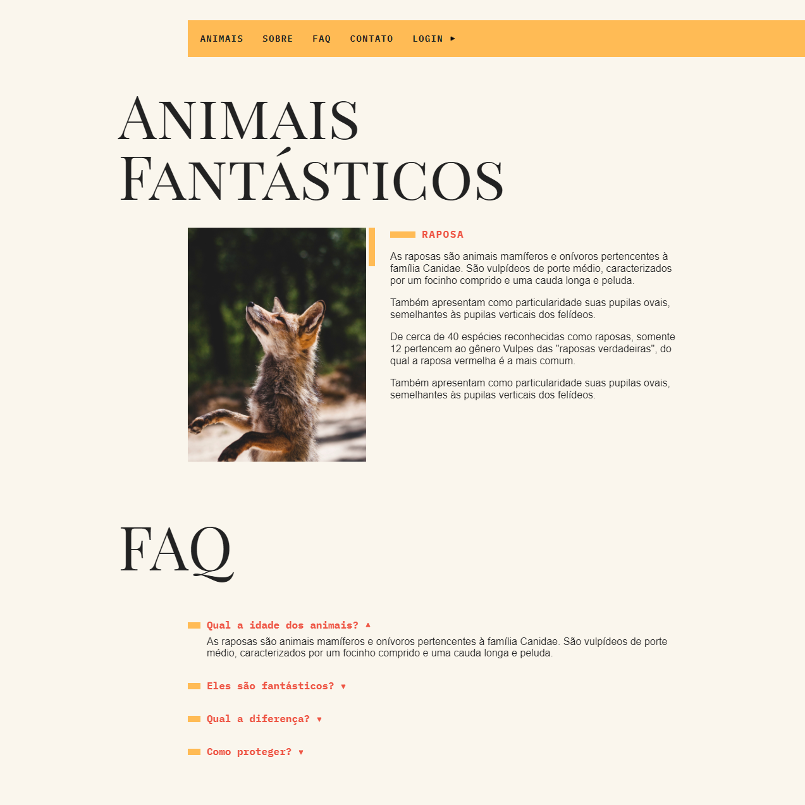
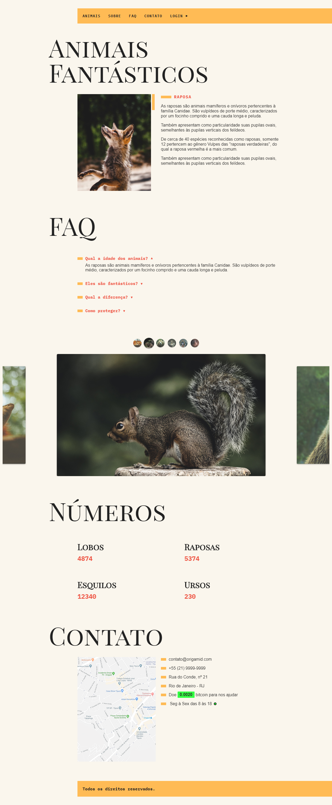
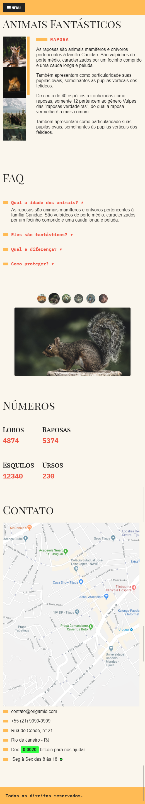

<h1 align="center">
    
</h1>

  
   
  

  

  

  <a href="#-sobre-o-projeto">Sobre o projeto</a>&nbsp;&nbsp;&nbsp;|&nbsp;&nbsp;&nbsp;
  <a href="#-tecnologias">Tecnologias</a>&nbsp;&nbsp;&nbsp;|&nbsp;&nbsp;&nbsp;
  <a href="#-projeto-final">Projeto final</a>

 

  

## 💻 Sobre o projeto

Site desenvolvido para obtenção do certificado de conclusão do curso de **JavaScript ES6+ Completo** da [Origamid](https://www.origamid.com/curso/javascript-completo-es6/).

## 🚀 Tecnologias

Esse projeto foi desenvolvido com as seguintes tecnologias:

- [JavaScript ES6](https://developer.mozilla.org/pt-BR/docs/Web/JavaScript)
- [CSS3](https://developer.mozilla.org/pt-BR/docs/Web/CSS)
- [HTML5](https://developer.mozilla.org/pt-BR/docs/Web/HTML)
- [CSS Grid Layout](https://www.origamid.com/projetos/css-grid-layout-guia-completo/)

## 📝 TO DO

- [x] Adicionar o modal para login
- [x] Adicionar tooltip
- [x] Implementar menu dropdown
- [x] Adicionar menu-mobile
- [x] Adicionar efeito de animação dos números
- [x] Adicionar horário de funcionamento e ícone para informar se está aberto ou fechado
- [x] Alimentar o site com uma API externa
- [x] Refatorar funções
- [x] Adicionar slides
- [ ] Adicionar gifs no preview do README.md

## 🌐 Projeto final
[Clique aqui](https://vilsonsampaio.github.io/animais-fantasticos/) para acessar o projeto no ar!

### 🖥 Desktop

### 📱 Mobile

---

Feito com ❤️ <a href="https://vilsonsampaio.github.io/animais-fantasticos">Vilson Sampaio</a>

